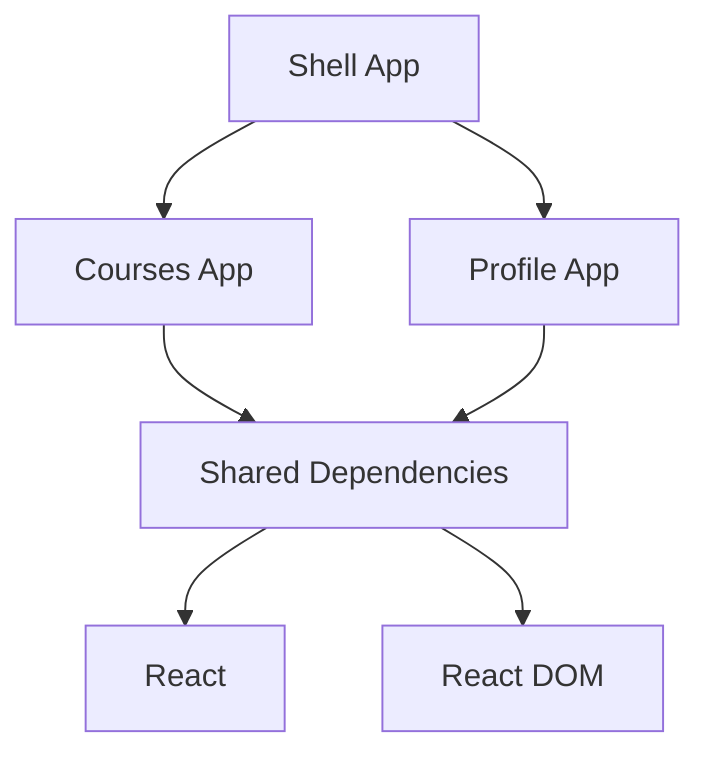

# Nx Module Federation with Zephyr

A modern micro-frontend architecture demonstration using Module Federation, built with Nx monorepo and Zephyr. This project showcases how to build scalable, modular web applications using cutting-edge technologies.

🔗 [Live Demo](https://nx-zephyr-module-federation-shell.vercel.app/)

## Project Overview

This monorepo contains three main applications that work together using Module Federation:

- **Shell** (Host Application)

  - Main container application
  - Handles routing and navigation
  - Integrates remote modules seamlessly
  - Modern header with responsive design

- **Courses** (Remote Module)

  - Course listing interface
  - Beautiful card-based layout
  - Tech-focused course content
  - Responsive grid design

- **Profile** (Remote Module)
  - Student profile dashboard
  - Learning statistics
  - Progress tracking
  - Interactive UI elements

## Technology Stack

### Core Technologies

- **Nx** (v20.7.2)

  - Monorepo management
  - Efficient build system
  - Smart caching
  - Project dependency graph

- **Module Federation**

  - Runtime dependency sharing
  - Dynamic remote loading
  - Shared component library
  - Micro-frontend architecture

- **Zephyr**
  - Custom RSBuild plugin
  - Enhanced build configuration
  - Optimized module federation setup

### Build Tools

- **RSBuild/RSPack**

  - Next-generation build tool
  - Fast compilation
  - Built-in optimizations
  - Module Federation support

- **Biome**
  - Modern JavaScript/TypeScript toolchain
  - Linting and formatting
  - Performance focused

### Frontend Stack

- **React** (v19.1.0)

  - Component-based architecture
  - Modern React features
  - Efficient rendering

- **TypeScript**
  - Type safety
  - Enhanced developer experience
  - Better code maintainability

## Architecture

The project uses a micro-frontend architecture with Module Federation:



## Deployment

The project is deployed on Vercel with separate deployments for each application:

- Shell App: [https://nx-zephyr-module-federation-shell.vercel.app/](https://nx-zephyr-module-federation-shell.vercel.app/)
- Courses App: Remote module integrated with Shell
- Profile App: Remote module integrated with Shell

## Getting Started

1. **Clone the repository**

```bash
git clone https://github.com/lavesan/nx-zephyr-module-federation-example.git
```

2. **Install dependencies**

```bash
pnpm install
```

3. **Start development servers**

```bash
pnpm dev
```

This will start all applications:

- Shell: http://localhost:3000
- Courses: http://localhost:3001
- Profile: http://localhost:3002

## Project Structure

```
nx-module-federation-with-zephyr/
├── apps/
│   ├── shell/          # Host application
│   ├── courses/        # Remote module for courses
│   └── profile/        # Remote module for profile
├── packages/
│   └── zephyr-rsbuild-plugin/  # Custom build plugin
└── [configuration files]
```

## Key Features

- **Dynamic Module Loading**: Remote modules are loaded on demand
- **Shared Dependencies**: Efficient runtime dependency sharing
- **Type Safety**: Full TypeScript support across all applications
- **Modern UI**: Responsive design with modern aesthetics
- **Build Optimization**: Efficient build process with RSBuild
- **Development Experience**: Hot Module Replacement (HMR) support

## Contributing

Contributions are welcome! Please feel free to submit a Pull Request.

## License

MIT
